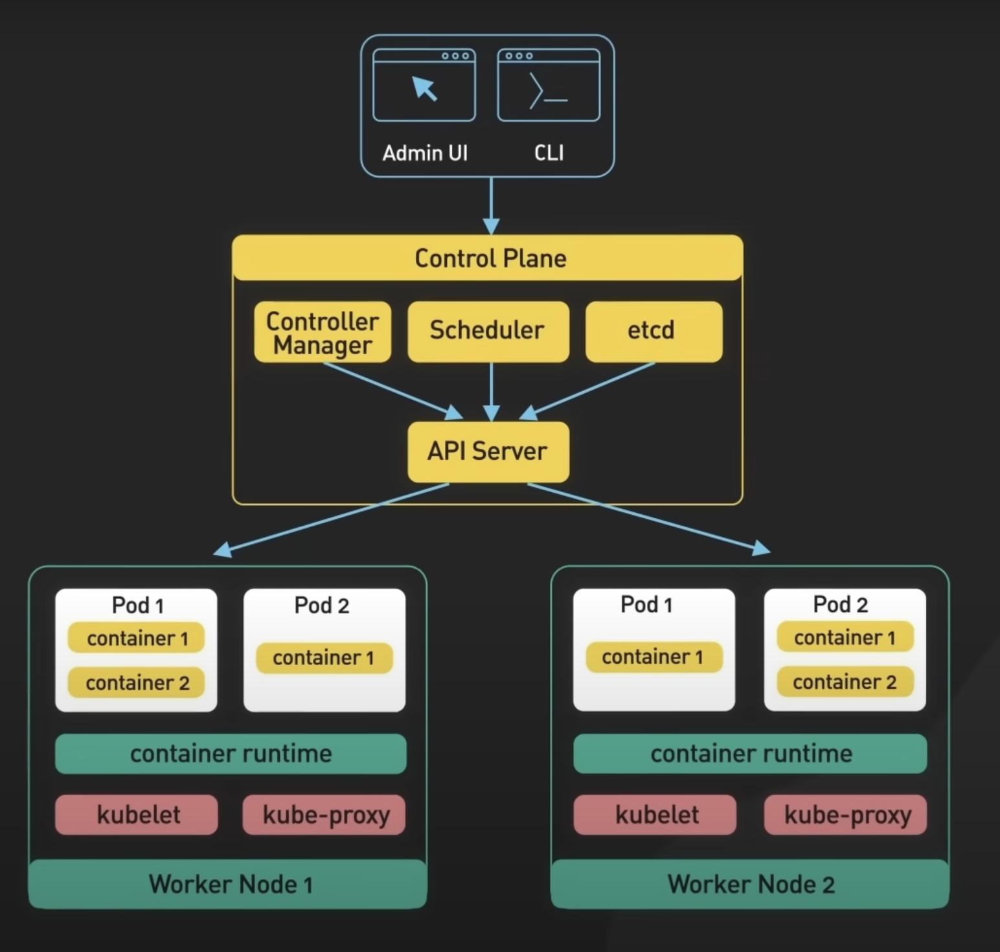

- **Cluster**: A set of worker machines, called nodes, that run containerized applications. A Kubernetes cluster includes at least one control plane and one or more worker nodes.
- **Control Plane**: The component responsible for managing the state of the cluster, making decisions about the cluster (scheduling, scaling), and ensuring the desired state of the system.
- **etcd**: A distributed key-value store used to store all cluster data, such as configuration, state, and metadata, ensuring high availability and consistency.
- **Controller Manager**: Manages different controllers that handle the lifecycle of resources (like pods, nodes, and endpoints) in the cluster. It ensures that the current state matches the desired state.
- **Scheduler**: Decides which node an unscheduled pod should run on based on resource requirements, policies, and available capacity.
- **API Server**: Acts as the front end of the Kubernetes control plane. It exposes the Kubernetes API, allowing users and services to interact with the cluster.
- **Nodes**: Worker machines in Kubernetes. Each node runs the services necessary to support the running of pods, and they communicate with the control plane.
- **Kubelet**: An agent that runs on each node, ensuring that containers are running in a pod as expected. It communicates with the control plane to receive pod definitions. It also provides a load balancing for the pods and ensure that traffic is distributed evenly across the pods.
- **Kubeproxy**: A network proxy that runs on each node and manages network rules to ensure that pods can communicate with each other and the outside world.
- **Container Runtime**: The software that is responsible for running containers. Popular runtimes include Docker, containerd, and CRI-O.
- **Pod**: The smallest deployable unit in Kubernetes, which can contain one or more containers that share resources like storage and networking.
- **Container**: A lightweight, standalone, executable package that includes everything needed to run an application (code, runtime, libraries). Kubernetes manages the deployment and scaling of containers via pods.
